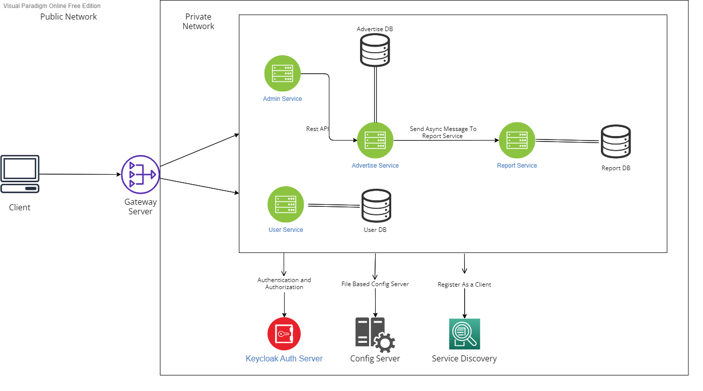

# Final Project
## Introduction
Restfull Advertisement Application made with Spring Boot, Spring Cloud, Microservices Architecture and many more.

Application has two user role which is "ADMIN" and "USER". A user can register and login with Keycloak Auth Server.
User, which is has "USER" role create,update,delete an advertisement via REST API's.
Also, System has "ADMIN" role when user create an advertisement it's status is waiting unless "ADMIN" user approve or reject.

Application don't expose inner services' endpoint. All request go through the Gateway Server.
Gateway Server filters those request and inject Correlation_ID to headers. That Correlation_ID propagates 
through inner services with down stream, therefore we can trace the request and collect logs.

## Architecture


* Servers
  * Gateway Server : Provide load balancing and filters request
  * Config Server : Provide the application properties it's client services
  * Eureka Server : Provide Service Discovery
  * Keycloak Server : Provide Authentication and Authorization

* Services
  * User Service : User can logins or register via user service
  * Advertise Service : CRUD operations for Advertisement
  * Admin Service : Admin can change advertisement's status
  * Report Service : When admin approve an advertisement, advertise service messaging with report service

* Databases(postgresql) : Advertisement, User and Report services have their own database.
* MessageBroker(rabbitmq) : Advertisement and Report services communicate with message queue.

## Tech Stack
* Core
  * Spring
    * Spring Boot
    * Spring Security
    * Spring Web
      * RestTemplate (Inner Service Communication) 
    * Spring Data
      * Spring Data JPA
    * Spring Cloud
      * Spring Cloud Config Server
      * Spring Cloud Config Client
      * Spring Cloud Gateway Server
  * Netflix
    * Eureka Server
    * Eureka Client
* Database
  * PostgreSQL
* Message Broker
  * RabbitMQ
* Security
  * Keycloak Server
  * Keycloak OAuth2
  * Keycloak REST API

## Quick Start

### Prerequisites
1. Apache Maven
2. Docker Desktop or CLI
3. Dockerfile Plugin 
4. Java 11 SDK, Project have been compiled with JetBrains SDK jbr11

### How To Start
```bash
# Clone this repo
$ git clone https://github.com/196-Emlakjet-Java-Spring-Bootcamp/final-project-fatihbuyukguclu.git

# To make docker image
$ mvn clean package dockerfile:build

# To Up Services
$ docker-compose up -d
```
## Study Resource

1. <a href="https://www.manning.com/books/spring-microservices-in-action-second-edition">Spring Microservices in Action, Second Edition</a>
2. <a href="https://www.manning.com/books/microservices-patterns"> Microservices Pattern With examples in Java</a>
